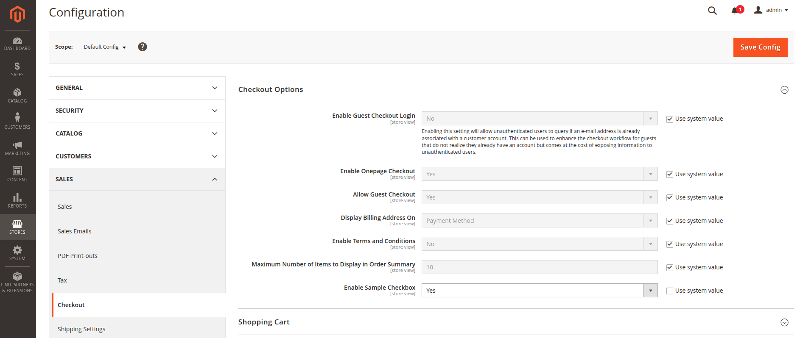
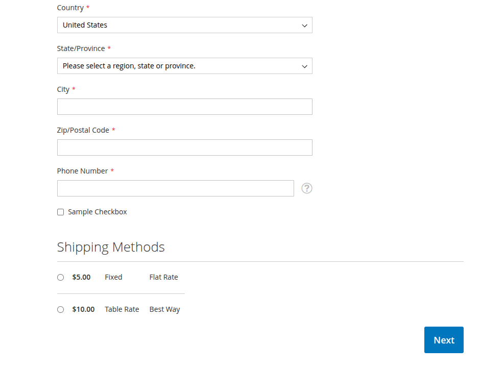
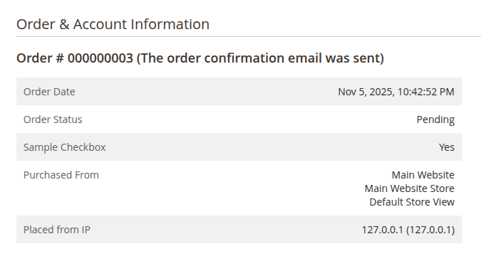

# Sample Checkout Checkbox

This module adds a configurable checkbox in the checkout shipping address fieldset. The checkbox value is saved on the order and can be seen in the admin order view page.

**This module is provided as a code sample for demonstration purposes only. It is not under active development or officially supported.**

## Configuration

The checkbox can be enabled in Checkout -> Checkout Options -> Enable Sample Checkbox.

## Checkout

The checkbox is placed below the phone number field in the shipping address.

## Admin Order View

The value can be seen in the admin order view page under order information.

